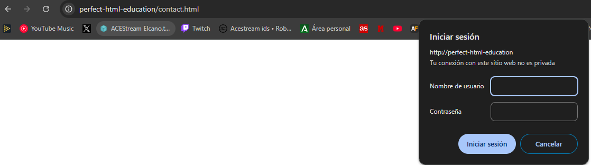

# Configuración de Servidor Apache (2.1)

## Migración de Nginx a Apache
Se ha realizado un cambio en la configuración de la máquina virtual Vagrant para utilizar Apache en lugar de Nginx. No se ha desinstalado Nginx, sino que simplemente se ha modificado el `Vagrantfile` para configurar Apache como servidor web principal.

### Cambios principales

- Se ha instalado Apache mediante:
  ```sh
  sudo apt install apache2
  ```
- Se han habilitado módulos esenciales para el correcto funcionamiento:
  - `a2enmod ssl`: Activa el soporte para conexiones seguras HTTPS.
  - `a2enmod rewrite`: Permite la reescritura de URLs para mejorar la gestión de rutas.
- Se han configurado los archivos de sitios virtuales (`.conf`) y habilitado con `a2ensite`.
- Se ha reiniciado Apache para aplicar los cambios con:
  ```sh
  sudo systemctl restart apache2
  ```

## Solución de error con vsftpd.conf
Se encontró un problema con el servicio `vsftpd`, que no arrancaba debido a errores de formato en el archivo `vsftpd.conf`.

### Solución aplicada

1. Se instaló la herramienta `dos2unix` con:
   ```sh
   sudo apt install dos2unix
   ```
2. Se ejecutó la conversión del archivo para corregir problemas de formato de línea:
   ```sh
   dos2unix /etc/vsftpd.conf
   ```
3. Se reinició el servicio para aplicar los cambios:
   ```sh
   sudo systemctl restart vsftpd
   ```

## Instalación de Make y WSL para acceso a archivos .html
Para acceder a `p2.2.html` y `p2.1.html` desde los archivos `.adoc` en un entorno Windows con WSL, se realizó la instalación de herramientas adicionales.

### Pasos realizados

1. Se instaló `make` con:
   ```sh
   sudo apt install make
   ```
2. Se configuró el entorno WSL para ejecutar `asciidoctor` y procesar archivos `.adoc` en HTML.
3. Se utilizó `make` para generar las páginas:
   ```sh
   make p2.2.html p2.1.html
   ```

Con esta configuración, se puede trabajar de manera eficiente con Apache, vsftpd y AsciiDoc en un entorno de desarrollo basado en Vagrant y WSL.

# Configuración de Autenticación Básica en Apache (2.2)

## Tareas

## 2.1. T.1 - Verificación de la autenticación en los logs con Apache2

### 1️⃣ Acceso con un usuario incorrecto  
Intentamos autenticarnos con credenciales erróneas:  


## 2.2. T.2 - Aplicar autenticación solo en `contact.html`

### 1️⃣ Acceso a la máquina virtual

Nos conectamos a la máquina con Vagrant:

```sh
vagrant ssh
```

---

### 2️⃣ Modificar la configuración de Apache

Abrimos el archivo de configuración del sitio web:

```sh
sudo nano /etc/apache2/sites-available/perfect-html-education.conf
```

---

### 3️⃣ Eliminar la autenticación en el directorio raíz

Borramos las siguientes líneas si están presentes dentro de `<Location />`:

```apache
AuthType Basic
AuthName "Área restringida"
AuthUserFile /etc/apache2/.htpasswd
Require valid-user
```

---

### 4️⃣ Agregar autenticación solo en `contact.html`

Insertamos este nuevo bloque debajo:

```apache
<Location /contact.html>
    AuthType Basic
    AuthName "Área restringida"
    AuthUserFile /etc/apache2/.htpasswd
    Require valid-user
</Location>
```

---

### 5️⃣ Guardar los cambios y reiniciar Apache

```sh
sudo systemctl restart apache2
```

---

### 6️⃣ Prueba de acceso

- **Accede a **`` → Debe pedir usuario y contraseña.
- **Accede a **``** u otras páginas** → No debe pedir autenticación.

---





Adjunta aquí una captura de:\
✅ Intento de acceso a `contact.html` con autenticación.\
✅ Acceso a otra página sin autenticación.


## 3.1 Configura Nginx para que no deje acceder con la IP de la máquina anfitriona al directorio raíz de una de tus dos webs. Modifica su server block o archivo de configuración. Comprueba como se deniega el acceso:


## 3.2 Configura Nginx para que desde tu máquina anfitriona se tenga que tener tanto una IP válida como un usuario válido, ambas cosas a la vez, y comprueba que sí puede acceder sin problemas

*Acceso correcto
